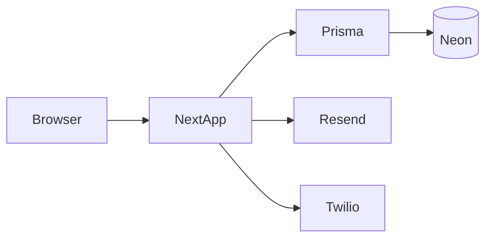

# StaffStack — Architecture

## High-level

StaffStack is a **multi-tenant B2B scheduling** product built as a **single Next.js** application:

- **UI:** React Server Components first; **Server Actions** for mutations; **Tailwind + shadcn/ui**.
- **Data:** **Prisma** ORM → **PostgreSQL** (Neon).
- **Auth:** **Auth.js** (NextAuth v5) with credentials; OAuth env-ready.
- **Integrations:** **Resend** (email), **Twilio** (SMS), optional **Stripe** (billing webhooks).

## Request path

1. **Middleware** — security headers, optional auth redirect for protected routes.
2. **Session** — Auth.js session from cookie; load `User`, active `Tenant`, `SiteMembership` roles.
3. **Tenant context** — resolve tenant by slug or session; validate `TenantUser` membership.
4. **Authorization** — RBAC helper checks permission for tenant/site scope.
5. **Data layer** — repositories query with mandatory `tenantId` filter.

## Module boundaries

| Area            | Location                    |
| --------------- | --------------------------- |
| Auth config     | `src/lib/auth.ts`           |
| DB client       | `src/lib/db.ts`             |
| Env validation  | `src/lib/env.ts`            |
| RBAC            | `src/lib/rbac.ts`           |
| Repositories    | `src/server/repositories/*` |
| Domain services | `src/server/services/*`     |
| Server Actions  | `src/server/actions/*`      |
| REST API        | `src/app/api/v1/*`          |

## REST vs Server Actions

- **Server Actions:** first-party UI mutations (same-origin, session cookie).
- **REST `/api/v1`:** integrations, scripts, future API keys (premium); Bearer auth when implemented.

## Realtime

MVP uses **revalidation** (`revalidatePath` / `revalidateTag`) after mutations. Optional later: **SSE** per site for live boards.

## File attachments (MVP)

Binary in PostgreSQL (`FileObject.data` **Bytes**) with metadata, MIME allowlist, and max size enforced in Server Actions. Migration path: add `objectKey` + external storage provider.

## Multi-tenancy

Logical isolation: every tenant-owned row includes `tenantId`. Application layer enforces scoping; optional future **PostgreSQL RLS** for defense-in-depth.

## Diagram (conceptual)

## Related docs

- [api.md](./api.md)
- [security.md](./security.md)
